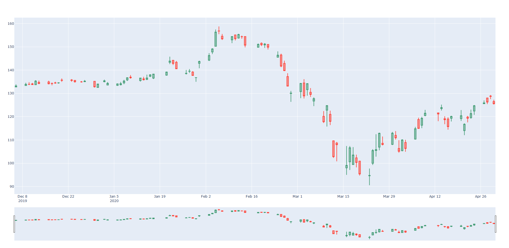

 # Stock Analyzer
Visualizer:

TODO:
* WRITE A CLASS FOR STOCK
    * GET THE KEY DATA FOR A STOCK
    * Update The stock function
    * API FOR STOCK DATA
    * Analyzing data over 100 days
    * Add volume to chart
* CONVERT THE DATA TO FORMATS WHICH CAN BE USED BY A NN
* WRITE A NEURAL NETWORK FOR ANALYSING THE DATA

 **Alpha Vantage API key: BXAVNFY9YVG3DJDW**