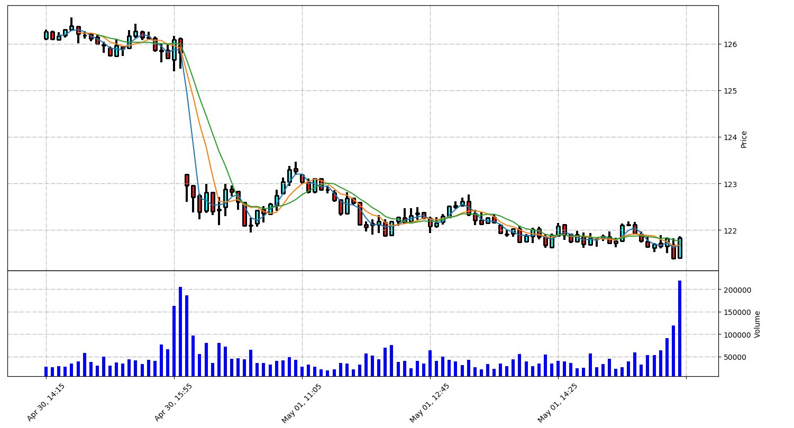

 # Stock Analyzer
Visualing the data(daily candles):

**TODO:**
* WRITE A CLASS FOR STOCK
    * Add technical analysis (head and shoulders, cup and handle etc..)
    * Make sure you get the same length with all the technical indicators
    * More Dynamic with all the types of technical indicators
    * Get Tweets about the given stock from ticker
    * Sentiment analysis from tweets with text processing using http://text-processing.com/docs/ - https://en.wikipedia.org/wiki/Sentiment_analysis

* CONVERT THE DATA TO FORMATS WHICH CAN BE USED BY A NN
* WRITE A NEURAL NETWORK FOR ANALYSING THE DATA

 **Alpha Vantage API key: BXAVNFY9YVG3DJDW**